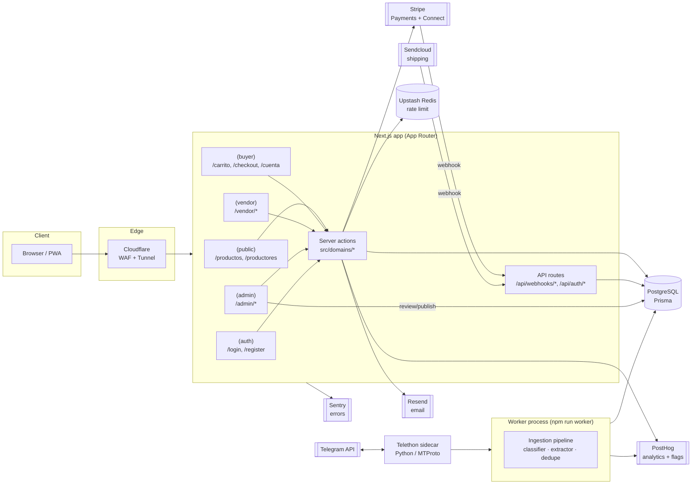

# Architecture Overview

## Purpose

High-level map of the runtime pieces of the marketplace: Next.js app, data layer, external services, and the background worker that powers Telegram ingestion.

## Key Entities / Concepts

- **Next.js app** (App Router) — single deployable serving public storefront, buyer, vendor, and admin route groups, plus server actions under `src/domains/*`.
- **API route handlers** — webhooks for Stripe and Sendcloud live under `src/app/api/webhooks/*`; auth routes under `src/app/api/auth/*`.
- **PostgreSQL via Prisma** — single database, schema in `prisma/schema.prisma`.
- **Worker process** (`npm run worker`) — separate process for Telegram ingestion & processing (heavy work never runs in the request lifecycle).
- **Telethon sidecar** — Python process speaking MTProto to Telegram, feeding raw messages into the worker.
- **External services** — Stripe (payments + Connect), Sendcloud (shipping), Resend (email), PostHog (analytics + flags), Sentry (errors), Cloudflare (tunnel/WAF), Upstash Redis (rate limit, optional).

## Diagram

## Notes

- **Single Next.js deploy** — there is no separate backend service; server actions (`src/domains/*`) are the API layer.
- **Worker is out-of-band** — the ingestion worker is a long-running Node process separate from the Next.js server; it must never be invoked from a request handler.
- **Stripe Connect** — for single-vendor orders with an onboarded vendor, payment intents use `transfer_data.destination` + `application_fee_amount`; otherwise funds stay on the platform account.
- **Redis is optional** — rate limiting falls back to an in-memory store when Upstash envs are absent.
- **Feature flags are fail-open** — PostHog outages must not block checkout; see `docs/conventions.md` § Feature flags.
