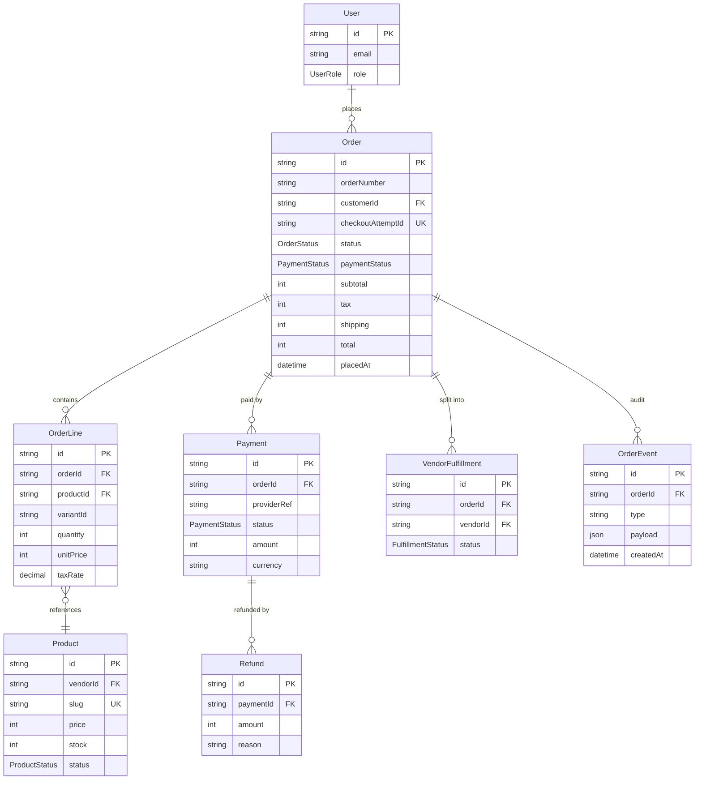

# Database ERD — Orders Focus

## Purpose

Zoomed-in view of the entities that participate in order creation, payment, and fulfillment. Use this when changing anything in the checkout or webhook paths.

## Key Entities / Concepts

- **Order** — snapshot row; created with `status = PLACED`, `paymentStatus = PENDING`. Has UNIQUE `checkoutAttemptId` for dedupe (see `docs/checkout-dedupe.md`).
- **OrderLine** — one per purchased line; snapshots product id, variant, quantity, unit price, tax rate.
- **Product** — reference target for `OrderLine`; prices/stock live here but are copied into `OrderLine` at order time.
- **User** — the buyer (`Order.customerId`).
- **Payment** — one Stripe Payment Intent per attempt; `providerRef` is the PI id. An order may accrue multiple rows across retries.
- **Refund** — partial or full reversal of a `Payment`.
- **VendorFulfillment** — per-vendor slice of the order; drives fulfillment state independently from `OrderStatus`.
- **OrderEvent** — append-only audit log for the order.

## Diagram

## Notes

- **Money is stored in integer minor units** (cents/céntimos) — never floats. `OrderLine.unitPrice`, `Order.total`, `Payment.amount`, `Refund.amount` are all integers.
- **`Order.checkoutAttemptId` is UNIQUE** — do not drop or relax this constraint; it is the primary dedupe mechanism for double-submitted checkouts. See `docs/checkout-dedupe.md`.
- **`OrderLine` snapshots `unitPrice` and `taxRate`** — mutating `Product.price` must not retroactively change historical orders.
- **`Payment` ↔ `Order` is N:1**, not 1:1: retries and representments create additional `Payment` rows. Never assume `order.payments[0]` is the authoritative payment — filter by `status = SUCCEEDED`.
- **`VendorFulfillment.status`** advances independently of `Order.status`. The aggregation rules for `PARTIALLY_SHIPPED` / `SHIPPED` live in `src/domains/shipping/transitions.ts` (see `docs/flows/order-state-machine.md`).
- **`OrderEvent` is append-only** — used by the payment incidents runbook (`docs/runbooks/payment-incidents.md`). Do not delete or mutate past rows.
- **Stock decrement on `Product`** happens inside the `createOrder()` transaction; compensating logic on cancel/refund must restore it.
