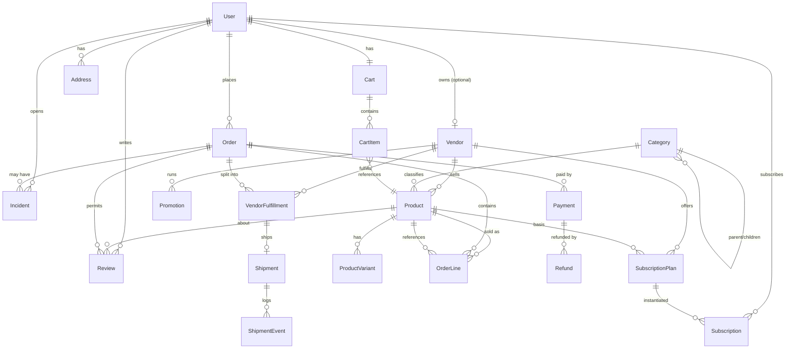

# Database ERD — Overview

## Purpose

Map of the core domain entities and their relationships. Minimal fields only; see `prisma/schema.prisma` for the full schema.

## Key Entities / Concepts

- **User** — buyers, vendors, and admins (distinguished by `UserRole`); optional 1:1 link to `Vendor`.
- **Vendor** — producer account; owns `Product` rows.
- **Category** — self-referential tree; `Product` has an optional category.
- **Product** — sellable item; has many `ProductVariant` and belongs to a `Vendor`.
- **Cart** / **CartItem** — per-user working basket before checkout.
- **Order** / **OrderLine** — immutable snapshot of a purchase.
- **Payment** / **Refund** — Stripe Payment Intent rows; one Order can have multiple payments (retries).
- **VendorFulfillment** / **Shipment** — per-vendor fulfillment inside a multi-vendor order, with a 1:1 `Shipment` tracking parcel state.
- **Review** — buyer feedback on a product, scoped to a specific order.
- **Incident** — dispute/issue thread attached to an order.
- **Subscription** / **SubscriptionPlan** — recurring purchase arrangements.
- **Promotion** — discount definitions applied per vendor at checkout.
- **Ingestion** models — separate subsystem; see `docs/database/erd-orders.md` focus + ingestion docs.

## Diagram

## Notes

- **User ↔ Vendor is 1:0..1** — a user may or may not be a vendor; a vendor always has exactly one user owner.
- **Category is recursive** — a self-join via `parentId`; products attach to leaf or internal categories.
- **VendorFulfillment** exists one-per-vendor-per-order — multi-vendor orders split here, not at the `Order` level.
- **Payment is a separate model**, not embedded on `Order`: one order can have multiple payment rows (e.g. retries) and each payment can have multiple refunds.
- **Review is scoped to `(orderId, productId)`** with a UNIQUE constraint — one review per product per order.
- **Subscription is UNIQUE on `(buyerId, planId)`** — a buyer can only hold one subscription per plan at a time.
- **Auxiliary models omitted** for clarity: `AuditLog`, `WebhookDelivery`, `WebhookDeadLetter`, `MarketplaceConfig`, `Favorite`, `Account`/`Session`/`VerificationToken` (NextAuth), `OrderEvent`, `EmailVerificationToken`, `PasswordResetToken`, `UserTwoFactor`, `ShippingZone`/`ShippingRate`, `CommissionRule`/`Settlement`, all `TelegramIngestion*` / `Ingestion*` models.
