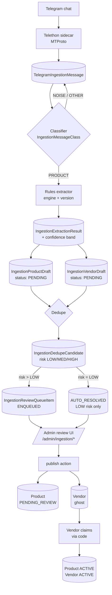

# Ingestion Pipeline

## Purpose

How raw Telegram messages become published `Product` + `Vendor` records via a rules-based classifier, extractor, dedupe stage, and admin review queue.

## Key Entities / Concepts

- **Input** — Telegram chats, read by the Telethon sidecar (Python, MTProto) into `TelegramIngestionMessage`.
- **Worker** — `npm run worker` drives `src/domains/ingestion/processing/*`; nothing runs in the Next.js request lifecycle.
- **Stages** — classify → extract → dedupe → review → publish → (optional) vendor claim.
- **Prisma models** — `TelegramIngestion{Connection,Chat,Message,MessageMedia,SyncRun}`, `IngestionJob`, `IngestionExtractionResult`, `IngestionProductDraft`, `IngestionVendorDraft`, `IngestionReviewQueueItem`, `IngestionDedupeCandidate`.
- **Flags** — `kill-ingestion-telegram`, `kill-ingestion-processing` (default killed); stage flags `feat-ingestion-{classifier,rules-extractor,dedupe}`.
- **Contract** — confidence bands `HIGH ≥ 0.80 / MEDIUM ≥ 0.50 / LOW < 0.50`; draft idempotency key `(sourceMessageId, extractorVersion, productOrdinal)`; only LOW-risk candidates auto-merge; review queue states `ENQUEUED` + `AUTO_RESOLVED`.

## Diagram

## Notes

- **Kill switches are default-on.** `kill-ingestion-telegram` and `kill-ingestion-processing` both default to `true`; the pipeline is dormant unless explicitly enabled. Stage flags (`feat-ingestion-*`) must also be flipped on to run classifier/extractor/dedupe.
- **Idempotency key** — drafts are keyed by `(sourceMessageId, extractorVersion, productOrdinal)`; re-running the extractor produces no dupes as long as the version does not change.
- **Only LOW-risk auto-merges.** MEDIUM and HIGH risk candidates must land in the review queue for a human decision.
- **Review queue states are limited** to `ENQUEUED` and `AUTO_RESOLVED` — no intermediate "in progress" state.
- **Ghost vendors** are placeholders created by the publish action; a real producer must claim them via a code before products become `ACTIVE` in the public catalog.
- **Heavy work only in the worker** — never import `src/workers/` or `src/domains/ingestion/processing/` from a route handler or server action invoked by a request.
- **See** `docs/ingestion/telegram.md` and `docs/ingestion/processing.md` for the authoritative contracts; this diagram is a map, not a spec.
