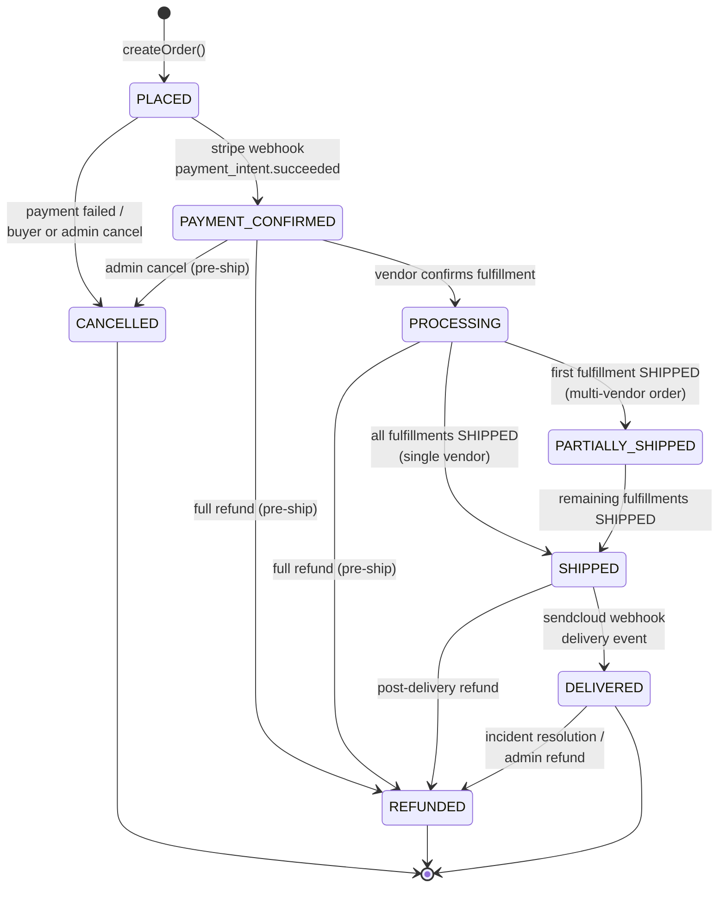

# Order State Machine

## Purpose

Defines every legal value of `OrderStatus` and the transitions the application actually performs. Any transition not drawn below is invalid.

## Key Entities / Concepts

- **Enum** — `OrderStatus` in `prisma/schema.prisma`.
- **States** — `PLACED`, `PAYMENT_CONFIRMED`, `PROCESSING`, `PARTIALLY_SHIPPED`, `SHIPPED`, `DELIVERED`, `CANCELLED`, `REFUNDED`.
- **Drivers** — order creation (server action), Stripe webhook, shipping transitions, admin actions, refund processing.

## Diagram

## Notes

- **`PLACED` is the only entry state.** It is set inside the `createOrder()` transaction; nothing else writes it.
- **`PAYMENT_CONFIRMED` is only written by the Stripe webhook** (`src/app/api/webhooks/stripe/route.ts`). The browser never advances this state.
- **`PARTIALLY_SHIPPED` vs `SHIPPED`** is derived from per-vendor `FulfillmentStatus` rows — it does not mean "some items"; it means "some vendors' fulfillments have shipped".
- **`DELIVERED`** comes from a Sendcloud webhook event, not a cron — if Sendcloud never reports delivery, orders can remain in `SHIPPED` indefinitely.
- **`CANCELLED` and `REFUNDED` are terminal.** No transition leaves them.
- **Never skip states.** E.g. `PLACED → SHIPPED` is illegal: payment confirmation must land first so the Stripe PI is captured.
- **Stock compensation** — transitioning to `CANCELLED` or `REFUNDED` must restore the stock that `createOrder()` decremented.
