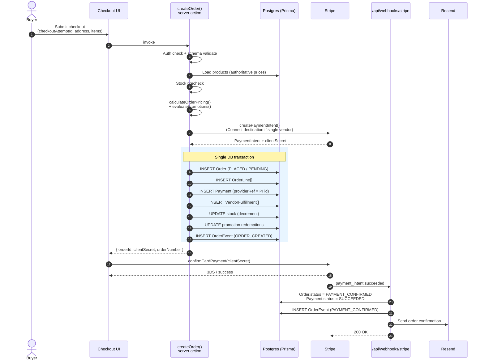

# Orders Flow

## Purpose

End-to-end happy path for turning a cart into a paid, confirmed order — including validation, Stripe interaction, and post-payment side effects.

## Key Entities / Concepts

- **Entry point** — `createOrder()` server action in `src/domains/orders/actions.ts`.
- **Pricing** — computed server-side only; client cart never supplies prices.
- **Payment** — a Stripe Payment Intent is created inside the same DB transaction that writes the `Order`, `OrderLine[]`, `Payment`, and `VendorFulfillment[]` rows.
- **Idempotency** — `Order.checkoutAttemptId` UNIQUE constraint dedupes double-submits; see `docs/checkout-dedupe.md`.
- **Confirmation** — status flips to `PAYMENT_CONFIRMED` only via the Stripe webhook at `src/app/api/webhooks/stripe/route.ts` — never from the browser.

## Diagram

## Notes

- **Stock is decremented at order-creation time**, before payment clears. Failed payments therefore require a compensating stock restore on cancel/refund.
- **Prices are snapshot** onto `OrderLine` — later price changes on `Product` do not mutate historical orders.
- **`checkoutAttemptId`** is required on every call; the UNIQUE constraint makes a second attempt with the same id a no-op that returns the original order (see `docs/checkout-dedupe.md`).
- **Webhook is the only writer of `PAYMENT_CONFIRMED`** — browsers can lie; Stripe signatures can't. The webhook signature secret is `STRIPE_WEBHOOK_SECRET`.
- **Split-vendor orders** keep funds on the platform account; per-vendor payouts happen later via the settlements domain.
- **Incident runbook** for payment issues: `docs/runbooks/payment-incidents.md` — do not rename `checkout.*` or `stripe.webhook.*` log scopes without updating it.
