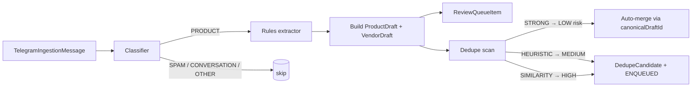
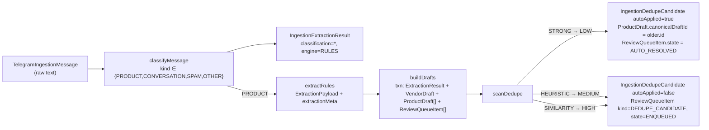

# Telegram ingestion — processing & drafts (Phase 2)

> Canonical reference for the deterministic processing layer. Read before
> touching `src/domains/ingestion/processing/` or the `Ingestion*` Prisma
> models. Phase 2 skeleton lands in PR-E; classifier + extractor + drafts
> in PR-F; dedupe + review queue in PR-G; observability + this doc
> finalised in PR-H.

Last verified against `main`: 2026-04-20.

## Overview

Phase 2 introduces the deterministic layer between raw `TelegramIngestionMessage`
rows and any future catalog publishing. Messages are classified, extracted
via rules, turned into `IngestionProductDraft` + `IngestionVendorDraft`,
deduplicated, and queued for human review. **No LLM**, no admin UI, no
writes to `Product` / `Vendor` / `ProductImage`.

### Non-goals (Phase 2)

- No LLM / external APIs. LLM lands in **Phase 2.5** behind a separate
  flag and only after we have real metrics on rules-only output.
- No admin UI. #667 / #668 stay paused.
- No writes to existing business tables.
- No auto-merge of `MEDIUM` or `HIGH` dedup candidates.

## Architecture



Every arrow is a pg-boss job, each with its own kill-switch probe, so
stopping the pipeline mid-flight never corrupts state.

## Locked contracts (do not drift)

| Contract | Value |
|---|---|
| Confidence range | `[0.0, 1.0]` stored as `Decimal(3,2)` |
| HIGH band | `≥ 0.80` |
| MEDIUM band | `≥ 0.50 and < 0.80` |
| LOW band | `< 0.50` |
| Draft idempotency key | `(sourceMessageId, extractorVersion, productOrdinal)` |
| Extraction idempotency key | `(messageId, extractorVersion)` |
| Dedupe auto-merge policy | LOW risk only; MEDIUM / HIGH → human review |
| Review queue states (Phase 2) | `ENQUEUED`, `AUTO_RESOLVED` (no others) |
| Classifier bias | Favour false negatives over false positives |

Changing any of the above is a cross-phase breaking change, not a silent
drift. Phase 2.5 (LLM) MUST emit values that respect the same contracts.

## Tradeoffs the operator should track (Phase 2)

These are **deliberate Phase-2 simplifications**, not stable semantics.
They exist so the rule layer stays auditable. Each is a candidate for
revisit in Phase 2.5 (LLM) or Phase 3 (admin tooling) once we have real
metrics.

### Price ranges ("4-6€/kg") → lower bound with halved confidence

**Decision** (PR-F): when the extractor sees `A-B€/unit`, it stores
`priceCents = lower(A, B)` and halves the price-field confidence to
`0.4`. The rule name `priceRangeLowerBound` is recorded in
`extractionMeta.priceCents` together with the full `A-B€/unit` source
substring. **`4-6€/kg` does NOT mean `4€/kg`.** Treat this as a
provisional readable-but-approximate value that the admin review must
settle before any downstream use.

- **Why not null?** Review queue still sees the range via the meta;
  lower bound + low confidence is useful triage signal.
- **Risk:** if anyone downstream reads `priceCents` without checking
  `confidenceBand` / the raw `source`, they silently under-price.
- **Mitigation:** the `IngestionProductDraft.rawFieldsSeen` column
  holds the original range string; admin UI must show it.

### Product classified PRODUCT but extractor returns zero → skip draft

**Decision** (PR-F): the drafts builder returns
`SKIPPED_NON_PRODUCT` when the classifier says PRODUCT but the
extractor can't find a price. No draft is created, only the audit
`IngestionExtractionResult` row. Deliberate false-negative bias —
"Ante ambigüedad: menos extracción, no más."

- **Expected real-world impact:** producer groups where price is
  announced separately ("DMs", "precio en privado", photo-only posts)
  will generate zero drafts. This is the documented cost of the
  conservative stance.
- **Observability:** the `ingestion.processing.drafts.classified_product_with_no_extractable_fields`
  log line fires on every such skip. Phase 2 operators should track
  the ratio:
  ```sql
  SELECT
    COUNT(*) FILTER (WHERE "classification"='PRODUCT')          AS products_classified,
    COUNT(*) FILTER (WHERE
      "classification"='PRODUCT' AND
      NOT EXISTS (
        SELECT 1 FROM "IngestionProductDraft"
         WHERE "sourceExtractionId" = "IngestionExtractionResult".id
      )
    )                                                          AS products_skipped_no_extraction
  FROM "IngestionExtractionResult";
  ```
- **Revisit trigger:** if skip-ratio climbs above ~20 % on real
  messages, the rule set is too strict and should be adjusted before
  enabling LLM enrichment (Phase 2.5) as a fallback.

## Components (populated as PRs land)

- [`src/domains/ingestion/processing/`](../../src/domains/ingestion/processing/)
  — public barrel.
  - `confidence.ts` — band thresholds + `confidenceBandFor` + `normaliseConfidence`.
  - `extractor-version.ts` — `CURRENT_RULES_EXTRACTOR_VERSION`.
  - `flags.ts` — `isProcessingKilled` + `isStageEnabled`.
  - `types.ts` — public surface re-exported from the top-level ingestion barrel.
  - `classifier/` — rules-based classifier (PR-F).
  - `extractor/` — rules extractor + Zod freeze test (PR-F).
  - `drafts/` — drafts builder + idempotent upsert (PR-F).
  - `dedupe/` — classification rules + scanner + LOW-only auto-merge (PR-G).
- `prisma/schema.prisma` — `IngestionExtractionResult`, `IngestionProductDraft`,
  `IngestionVendorDraft`, `IngestionReviewQueueItem`, `IngestionDedupeCandidate`.

## Dedupe (PR-G)

Every freshly built `ProductDraft` triggers a `telegram.dedupe.drafts`
job. The scanner compares the new draft pairwise against every other
canonical draft at the same `extractorVersion`, plus — for the vendor
side only — every canonical vendor with the same `externalId` across
versions.

### Classification taxonomy

| Kind | Rule | Risk | Action |
|---|---|---|---|
| `STRONG` | same vendor + same normalised name + same unit + same weight bucket + same priceCents (product)<br>— OR —<br>same `externalId` (vendor) | `LOW` | **Auto-merge** via `canonicalDraftId` + `duplicateOf` + review item transitions to `AUTO_RESOLVED` |
| `HEURISTIC` | same vendor + same normalised name + same unit, but priceCents or weight bucket differs | `MEDIUM` | `DedupeCandidate` row + `DEDUPE_CANDIDATE` review queue entry, priority 50 |
| `SIMILARITY` | different vendor, same normalised name (exact equality after NFD + accent strip + punctuation collapse) | `HIGH` | `DedupeCandidate` row + review queue entry, priority 100 |

Name normalisation strips case, accents, punctuation, emoji, and
collapses whitespace — but **does not** apply Levenshtein, stemming,
or embeddings. Anything weaker than exact normalised equality is left
alone in Phase 2.

### Every candidate is explainable

`IngestionDedupeCandidate.reasonJson` stores:

```json
{
  "reason": "identicalAcrossAllFields",
  "score": 1,
  "signals": [
    { "rule": "product.vendor.equal", "matched": "v1", "compared": "v1" },
    { "rule": "product.name.equal", "matched": "manzanas golden", "compared": "manzanas golden" },
    { "rule": "product.unit.equal", "matched": "KG", "compared": "KG" },
    { "rule": "product.weightBucket.equal", "matched": "none", "compared": "none" },
    { "rule": "product.priceCents.equal", "matched": 250, "compared": 250 }
  ]
}
```

Every auto-merge or review-queue entry can be explained without
re-running anything.

### Non-destructive, always

- Auto-merge sets `canonicalDraftId` + `duplicateOf` on the **newer**
  row only. The older canonical row stays untouched.
- Candidates and review rows persist forever (subject to retention in
  a later phase). An operator in Phase 3 can undo a merge by clearing
  the canonical pointers — no data recovery required.

### Metrics (Phase 2 baseline)

Every scan emits `ingestion.processing.dedupe.metrics` with:

- `candidatesCreated`
- `autoMerged`
- `enqueuedForReview`
- `autoMergeRatio` (of candidates)
- `reviewRatio` (of candidates)
- `byKind` — counts per STRONG / HEURISTIC / SIMILARITY
- `byRisk` — counts per LOW / MEDIUM / HIGH

For global aggregates, operators can query directly:

```sql
SELECT "riskClass", COUNT(*) FILTER (WHERE "autoApplied")    AS auto,
                    COUNT(*) FILTER (WHERE NOT "autoApplied") AS queued
  FROM "IngestionDedupeCandidate"
 WHERE "createdAt" > now() - interval '7 days'
 GROUP BY "riskClass";
```

Expected healthy distribution (Phase 2, rules-only):

- `LOW` (auto-merged): re-posts of the same listing. Low single-digit
  ratio relative to total drafts — most producers don't spam.
- `MEDIUM`: same seller + same product + price tweak. Should track
  producer-update frequency; investigate if it dominates.
- `HIGH`: same name across sellers. Useful for the admin to spot
  cross-seller overlap; never auto-acts.

## Feature flags

| Flag | Default | Role |
|---|---|---|
| `kill-ingestion-processing` | `true` (killed) | Umbrella kill. Overrides every stage. |
| `feat-ingestion-classifier` | `false` | Enables the classifier stage. |
| `feat-ingestion-rules-extractor` | `false` | Enables the rules extractor (after classifier). |
| `feat-ingestion-dedupe` | `false` | Enables dedup candidate creation + LOW-risk auto-merge. |

Fail-open policy from [`src/lib/flags.ts`](../../src/lib/flags.ts) applies to
all four. For the umbrella kill this means "killed by default on outage",
which is the conservative default. Stage flags that fail open during an
outage still cannot act because the kill check runs first.

## Rollout plan

PR-H finalises this section. Skeleton:

**Stages activate in this strict order — never all at once:**

| Order | Flag | Action | Wait before next step |
|---|---|---|---|
| 1 | `feat-ingestion-classifier` ON | Enable classifier only. | 48 h + `npm run ingestion:metrics -- --since 48h` shows no breach |
| 2 | `feat-ingestion-rules-extractor` ON | Extractor runs for PRODUCT classifications. Drafts appear. | 48 h + confidence histogram reasonable |
| 3 | `feat-ingestion-dedupe` ON | Dedupe scan + LOW auto-merge + review queue fill. | 72 h + `autoMergeRatio` stable |
| 4 | `kill-ingestion-processing` OFF | Release umbrella kill. Subsystem is GA for Phase 2. | — |

Each flag is independent. Flipping step 3 without step 2 is safe but
pointless (no drafts to scan); the scanner exits with `DRAFT_NOT_FOUND`.

### Step-by-step

1. **Dev only** — every flag off. `npm run ingestion:metrics` prints zeros.
   No processing jobs run.

2. **Classifier canary** — flip `feat-ingestion-classifier` ON for one
   admin email. Watch 48 h of `ingestion.processing.classify.*` logs.
   Every classification writes an `IngestionExtractionResult` audit
   row (no drafts yet — extractor still off). Check:
   ```bash
   npm run ingestion:metrics -- --since 48h
   ```
   Expected: PRODUCT share roughly matches producers' posting rate.
   Investigate if > 80 % of messages classify as PRODUCT (rules too
   permissive) or < 5 % (rules too strict for the chat's style).

3. **Extractor canary** — add `feat-ingestion-rules-extractor`. Drafts
   begin to land. Re-run metrics:
   - `skip.ratio` < `skipRatioMax` (0.20).
   - Zod freeze test green in CI.
   - At least one `HIGH` confidence-band draft per hundred messages.

4. **Dedupe canary** — add `feat-ingestion-dedupe`. Expect:
   - `dedupe.autoMergeRatio` < `autoMergeRatioMax` (0.35).
   - MEDIUM + HIGH candidates accumulate in the review queue — this
     is normal; Phase 3 UI will drain them.
   - `canonicalDraftId` populated on STRONG-auto-merged drafts only.

5. **Phase 2 GA** — flip `kill-ingestion-processing` OFF. Leave
   `feat-ingestion-admin` OFF until the Phase 3 admin UI reopens
   (#667, #668). The review queue accumulates in the background; no
   Product / Vendor writes fire.

### Rollback drill

Flip `kill-ingestion-processing` ON. Expected behaviour (pinned by
`test/integration/ingestion-dedupe-scanner.test.ts` and
`test/features/ingestion-processing-flags.test.ts`):

- New jobs short-circuit on the first probe and log
  `ingestion.processing.kill_switch_active`.
- In-flight jobs finish their current transaction (atomic) then exit
  cleanly.
- All drafts / candidates / review-queue rows already persisted stay
  intact (source of truth).

Incident override (PostHog itself down):
`FEATURE_FLAGS_OVERRIDE='{"kill-ingestion-processing":true}'` and
redeploy. Fail-open resolves to "killed".

### Cleanup tickets

Every `feat-*` flag added in Phase 2 is debt. File one per flag,
labelled `tech-debt,ingestion`, titled "Remove `feat-ingestion-<stage>`
gate 30 days post Phase 3 GA". Keep `kill-ingestion-processing`
forever.

## Retention

No new sweeping in Phase 2 — drafts and extraction results are
operational history. Phase 1's sweeper already handles the retention
profile for Telegram raw rows and ingestion-job artefacts. Revisit if
draft volumes become problematic.

## Runbook

Short, SQL-first playbook. Aligns with the Phase 1 runbook style
(grep by scope, thread by `correlationId`).

### 1. Is each stage really on or off?

```bash
npm run ingestion:metrics -- --since 1h
```

Reads from `IngestionExtractionResult` / `IngestionProductDraft` /
`IngestionDedupeCandidate` / `IngestionReviewQueueItem`, so it
reflects observable reality, not PostHog claims.

To corroborate with the flag service:

```sql
SELECT flag, value FROM posthog_feature_flag_local_override;  -- or operator UI
```

Both answers should agree. If they don't, PostHog is the source of
truth — the worker rechecks on every job.

### 2. Confirm there are no writes outside ingestion

```sql
SELECT table_name, COUNT(*) AS rows_last_24h
  FROM information_schema.columns c
  JOIN pg_stat_user_tables t ON t.relname = c.table_name
 WHERE c.column_name = 'createdAt'
   AND c.table_schema = 'public'
   AND c.table_name IN ('Product', 'Vendor', 'ProductImage')
 GROUP BY table_name;
```

Compare against the pre-Phase-2 baseline. Any delta on those tables
during a processing run is a regression — pause ingestion
immediately (`kill-ingestion-processing` ON).

### 3. Inspect drafts created in the last N hours

```sql
SELECT
  id, "productName", "priceCents", unit, "confidenceBand",
  "canonicalDraftId", "duplicateOf"
FROM "IngestionProductDraft"
WHERE "createdAt" > now() - interval '24 hours'
ORDER BY "createdAt" DESC
LIMIT 50;
```

A `canonicalDraftId IS NOT NULL` row was auto-merged. Follow the
pointer to see the surviving canonical. An empty `productName` is
always a bug — investigate the source message.

### 4. Inspect review queue

```sql
SELECT kind, state, COUNT(*) AS rows
  FROM "IngestionReviewQueueItem"
 GROUP BY kind, state
 ORDER BY kind, state;
```

Expected healthy shape:

- `PRODUCT_DRAFT / ENQUEUED` > 0 (drafts awaiting review).
- `PRODUCT_DRAFT / AUTO_RESOLVED` > 0 only if `feat-ingestion-dedupe`
  has been ON for a while.
- `DEDUPE_CANDIDATE / ENQUEUED` accumulates until Phase 3 UI drains it.
- Any other state does not exist in Phase 2 — schema rejects them.

### 5. Read the skip / dedupe metrics

```bash
npm run ingestion:metrics -- --since 24h
```

Look at:

- `Skip ratio` → extractor strictness.
- `auto-merge` + `review-queued` ratios → dedupe aggressiveness.
- `by confidence band` → drift signal.

Full thresholds + hints are in the "Acceptance thresholds" section
below; the CLI exits non-zero and prints a hint when any threshold is
breached.

### 6. When to revert flags

| Symptom | Action |
|---|---|
| `ingestion.telegram.*` shows unusual delays in the worker | Flip `kill-ingestion-processing` ON — processing stalls the worker. Phase 1 sync still runs. |
| `npm run ingestion:metrics` shows skip ratio > 0.40 | Flip `feat-ingestion-rules-extractor` OFF. Classifier keeps auditing; review rules. |
| Auto-merge ratio > 0.60 | Flip `feat-ingestion-dedupe` OFF. Candidates stop forming. Existing canonical pointers persist (non-destructive). |
| Review queue ENQUEUED > `queueEnqueuedMax` | Flip `feat-ingestion-dedupe` OFF. The queue freezes in place; Phase 3 UI will drain it once live. |
| Unexpected write to `Product` / `Vendor` | Flip `kill-ingestion-processing` ON and open an incident. The schema forbids such writes; if they happen, something external (manual SQL, misrouted action) is at fault. |

### 7. What if the noise goes up too much?

Rules can drift silently when producers change their posting style.
If signal quality degrades:

1. **Do NOT edit historical rows.** They are the source of truth for
   this rules version.
2. Bump `CURRENT_RULES_EXTRACTOR_VERSION` in
   `src/domains/ingestion/processing/extractor-version.ts` (e.g.
   `"rules-1.0.0"` → `"rules-1.1.0"`).
3. Edit `classifier/rules.ts` or `extractor/rules.ts`. Add fixtures
   covering the regression case to `test/fixtures/ingestion-messages/`
   so the exact symptom can't regress silently again.
4. Deploy. Re-processing at the bumped version creates NEW
   `IngestionExtractionResult` rows; old rows stay. Dedupe will not
   auto-merge across versions for product drafts (intentional).
5. Re-run `npm run ingestion:metrics` and confirm the noise metrics
   dropped.

### 8. Confirm zero web-app impact

Same recipe as Phase 1:

```bash
grep -rE "from ['\"]@/workers|from ['\"]@/lib/queue['\"]" \
     src/app src/components \
     | grep -v src/workers
# expected: no output — processing never crosses into the web graph
```

Processing handlers run exclusively in `npm run worker`. If any
import of `@/workers/*` or `@/lib/queue` shows up in the web tree,
treat it as a regression.

## Acceptance thresholds (Phase 2 baseline)

**Orientative**, not hard gates. `npm run ingestion:metrics` exits
with a hint when one is breached. Numbers live in
[`src/domains/ingestion/processing/observability/thresholds.ts`](../../src/domains/ingestion/processing/observability/thresholds.ts);
move them there AND in this table in the same commit.

| Threshold | Value | What it flags |
|---|---|---|
| `skipRatioMax` | 0.20 | Classifier says PRODUCT but extractor finds zero fields. Rules too strict. |
| `autoMergeRatioMax` | 0.35 | STRONG firing too often — accidental re-processing at a bumped version without idempotency, or producers spamming. |
| `reviewRatioMax` | 0.60 | MEDIUM + HIGH dominate; review queue will not clear. |
| `queueEnqueuedMax` | 500 | ENQUEUED review rows exceed what the Phase 3 UI is expected to absorb at launch. |
| `lowMediumConfidenceRatioMax` | 0.80 | Most drafts land below HIGH confidence; rules too uncertain — investigate before enabling LLM (Phase 2.5). |

## End-to-end cycle reference

Concrete example of a run at the end of Phase 2 with classifier +
extractor + dedupe all on.



### Worked example

**Input** (three messages in order):

```
msg-1 author:42  "Manzanas golden 2,50€/kg"
msg-2 author:42  "Manzanas golden 2,50€/kg"         (exact duplicate)
msg-3 author:99  "Manzanas golden 2,80€/kg"         (different seller)
```

**Expected output** after full cycle:

| Row | Table | Shape |
|---|---|---|
| `ex-1` | `IngestionExtractionResult` | classification=`PRODUCT`, extractorVersion=`rules-1.0.0` |
| `ex-2` | `IngestionExtractionResult` | classification=`PRODUCT`, messageId=msg-2 |
| `ex-3` | `IngestionExtractionResult` | classification=`PRODUCT`, messageId=msg-3 |
| `v-42` | `IngestionVendorDraft` | externalId=`42`, canonicalDraftId=null |
| `v-99` | `IngestionVendorDraft` | externalId=`99`, canonicalDraftId=null |
| `pd-1` | `IngestionProductDraft` | vendorDraftId=`v-42`, priceCents=250, canonicalDraftId=null |
| `pd-2` | `IngestionProductDraft` | vendorDraftId=`v-42`, priceCents=250, **canonicalDraftId=`pd-1`**, duplicateOf=`pd-1` |
| `pd-3` | `IngestionProductDraft` | vendorDraftId=`v-99`, priceCents=280, canonicalDraftId=null |
| `cand-strong` | `IngestionDedupeCandidate` | kind=`STRONG`, riskClass=`LOW`, autoApplied=`true` |
| `cand-sim` | `IngestionDedupeCandidate` | kind=`SIMILARITY`, riskClass=`HIGH`, autoApplied=`false` |
| `rq-1` | `IngestionReviewQueueItem` | kind=`PRODUCT_DRAFT`, targetId=`pd-1`, state=`ENQUEUED` |
| `rq-2` | `IngestionReviewQueueItem` | kind=`PRODUCT_DRAFT`, targetId=`pd-2`, **state=`AUTO_RESOLVED`** |
| `rq-3` | `IngestionReviewQueueItem` | kind=`PRODUCT_DRAFT`, targetId=`pd-3`, state=`ENQUEUED` |
| `rq-4` | `IngestionReviewQueueItem` | kind=`DEDUPE_CANDIDATE`, targetId=`cand-sim`, state=`ENQUEUED`, priority=100 |

This is pinned by [`test/integration/ingestion-cycle-end-to-end.test.ts`](../../test/integration/ingestion-cycle-end-to-end.test.ts).

## Phase 2.5 — local LLM extractor (opt-in)

The Phase 2.5 gate documented earlier was opened in PR #935. Why now:

- ~1 500 raw messages from one live forum-style group ran through the
  rules pipeline. Result: 1 PRODUCT, 2 PRODUCT_NO_PRICE, 34 SPAM,
  the rest CONVERSATION/OTHER. The chat's admin policy *forbids*
  public prices, so the rules extractor cannot find them — by design.
- A 12-message labelled benchmark across `qwen2.5:0.5b/1.5b/3b/7b`,
  `phi3.5`, `gemma2:2b`, and `llama3.2:3b` (running locally on
  Ollama at `127.0.0.1:11434`) showed **`qwen2.5:3b` at 92 % accuracy
  and 5.5 s avg per message on CPU** — winning *both* on accuracy and
  latency over the 7B model.
- Cost target: **0 €** recurring. No third-party APIs.

### How it works

When `feat-ingestion-llm-extractor` is on (and the umbrella kill is
off), the worker:

1. Calls Ollama's `/api/generate` with `format: "json"` and a frozen
   system prompt that asks for a 6-way classification + a list of
   `vendor_offers` with category hints. Hard timeout 60 s.
2. Validates the response with `llmResponseSchema` (Zod).
3. Maps the LLM verdict to the existing `MessageClass` /
   `ExtractionPayload` contract:
   - `VENDOR_OFFERING` + any `has_price_signal=true` → `PRODUCT`
   - `VENDOR_OFFERING` without price → `PRODUCT_NO_PRICE`
   - `BUYER_QUERY` / `QUESTION_ANSWER` / `DISCUSSION` → `CONVERSATION`
   - `SPAM` / `OTHER` passthrough.
4. Persists with `extractorVersion='llm-qwen2.5-3b-v1'`. The
   `IngestionExtractionResult.engine` column stays `RULES` for now —
   `extractorVersion` is the source of truth for "which extractor
   ran"; flipping the engine column is a contract migration deferred
   until we drop rules entirely.
5. **Any LLM failure** (transport, timeout, JSON parse, schema
   mismatch) logs `ingestion.processing.llm.fallback_to_rules` and
   re-runs the rules pipeline. Ingestion is never blocked on the LLM.

### Tunables

| Env var | Default | Purpose |
|---|---|---|
| `OLLAMA_URL` | `http://127.0.0.1:11434` | Where the local Ollama listens. |
| `INGESTION_LLM_MODEL` | `qwen2.5:3b` | Model tag passed to Ollama. |
| `INGESTION_LLM_TIMEOUT_MS` | `60000` | Hard cap per call. |

### Flags

| Flag | Default | When `true` |
|---|---|---|
| `feat-ingestion-llm-extractor` | `false` | Worker tries the LLM first; falls back to rules on any error. |

### Operational notes

- Throughput: ~5–10 messages / second across the 4-worker pool with
  `qwen2.5:3b` on a CPU box; orders of magnitude slower than rules.
  Real-time ingestion stays fine — backfilling a 100k-message chat
  takes hours, not minutes.
- Fallback rate: tracked via the `ingestion.processing.llm.fallback_to_rules`
  log scope. Spikes in this metric mean Ollama is unreachable / OOM.
- Rolling forward to a different model: set `INGESTION_LLM_MODEL`,
  pull the new model with `ollama pull <name>`, restart the worker.
  Bump `CURRENT_LLM_EXTRACTOR_VERSION` in `extractor/llm.ts` to
  signal a re-process — the `(messageId, extractorVersion)` unique
  constraint preserves history of every model that ever ran.
- Disabling: set `feat-ingestion-llm-extractor=false`. New jobs run
  rules-only; existing LLM extraction rows stay in DB as audit.

## Decisions log

- **2026-04-20 — Rules-only in Phase 2.** LLM deferred to 2.5. Reason:
  stability + reproducibility first; metrics before complexity.
- **2026-04-20 — LOW-only auto-merge.** MEDIUM / HIGH require human
  review. Non-destructive dedupe via `canonicalDraftId` / `duplicateOf`;
  rows never deleted.
- **2026-04-20 — Frozen confidence bands.** HIGH ≥ 0.80, MEDIUM ≥ 0.50.
  Shift requires a cross-phase migration + a deliberate breaking change.
- **2026-04-20 — `extractorVersion` stamped on every row.** Makes
  re-processing at a new rule version additive, never destructive.
