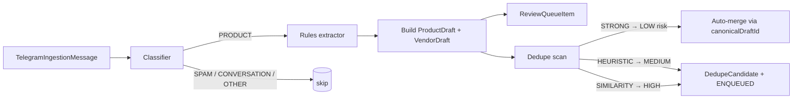

# Telegram ingestion — processing & drafts (Phase 2)

> Canonical reference for the deterministic processing layer. Read before
> touching `src/domains/ingestion/processing/` or the `Ingestion*` Prisma
> models. Phase 2 skeleton lands in PR-E; classifier + extractor + drafts
> in PR-F; dedupe + review queue in PR-G; observability + this doc
> finalised in PR-H.

Last verified against `main`: 2026-04-20.

## Overview

Phase 2 introduces the deterministic layer between raw `TelegramIngestionMessage`
rows and any future catalog publishing. Messages are classified, extracted
via rules, turned into `IngestionProductDraft` + `IngestionVendorDraft`,
deduplicated, and queued for human review. **No LLM**, no admin UI, no
writes to `Product` / `Vendor` / `ProductImage`.

### Non-goals (Phase 2)

- No LLM / external APIs. LLM lands in **Phase 2.5** behind a separate
  flag and only after we have real metrics on rules-only output.
- No admin UI. #667 / #668 stay paused.
- No writes to existing business tables.
- No auto-merge of `MEDIUM` or `HIGH` dedup candidates.

## Architecture



Every arrow is a pg-boss job, each with its own kill-switch probe, so
stopping the pipeline mid-flight never corrupts state.

## Locked contracts (do not drift)

| Contract | Value |
|---|---|
| Confidence range | `[0.0, 1.0]` stored as `Decimal(3,2)` |
| HIGH band | `≥ 0.80` |
| MEDIUM band | `≥ 0.50 and < 0.80` |
| LOW band | `< 0.50` |
| Draft idempotency key | `(sourceMessageId, extractorVersion, productOrdinal)` |
| Extraction idempotency key | `(messageId, extractorVersion)` |
| Dedupe auto-merge policy | LOW risk only; MEDIUM / HIGH → human review |
| Review queue states (Phase 2) | `ENQUEUED`, `AUTO_RESOLVED` (no others) |
| Classifier bias | Favour false negatives over false positives |

Changing any of the above is a cross-phase breaking change, not a silent
drift. Phase 2.5 (LLM) MUST emit values that respect the same contracts.

## Tradeoffs the operator should track (Phase 2)

These are **deliberate Phase-2 simplifications**, not stable semantics.
They exist so the rule layer stays auditable. Each is a candidate for
revisit in Phase 2.5 (LLM) or Phase 3 (admin tooling) once we have real
metrics.

### Price ranges ("4-6€/kg") → lower bound with halved confidence

**Decision** (PR-F): when the extractor sees `A-B€/unit`, it stores
`priceCents = lower(A, B)` and halves the price-field confidence to
`0.4`. The rule name `priceRangeLowerBound` is recorded in
`extractionMeta.priceCents` together with the full `A-B€/unit` source
substring. **`4-6€/kg` does NOT mean `4€/kg`.** Treat this as a
provisional readable-but-approximate value that the admin review must
settle before any downstream use.

- **Why not null?** Review queue still sees the range via the meta;
  lower bound + low confidence is useful triage signal.
- **Risk:** if anyone downstream reads `priceCents` without checking
  `confidenceBand` / the raw `source`, they silently under-price.
- **Mitigation:** the `IngestionProductDraft.rawFieldsSeen` column
  holds the original range string; admin UI must show it.

### Product classified PRODUCT but extractor returns zero → skip draft

**Decision** (PR-F): the drafts builder returns
`SKIPPED_NON_PRODUCT` when the classifier says PRODUCT but the
extractor can't find a price. No draft is created, only the audit
`IngestionExtractionResult` row. Deliberate false-negative bias —
"Ante ambigüedad: menos extracción, no más."

- **Expected real-world impact:** producer groups where price is
  announced separately ("DMs", "precio en privado", photo-only posts)
  will generate zero drafts. This is the documented cost of the
  conservative stance.
- **Observability:** the `ingestion.processing.drafts.classified_product_with_no_extractable_fields`
  log line fires on every such skip. Phase 2 operators should track
  the ratio:
  ```sql
  SELECT
    COUNT(*) FILTER (WHERE "classification"='PRODUCT')          AS products_classified,
    COUNT(*) FILTER (WHERE
      "classification"='PRODUCT' AND
      NOT EXISTS (
        SELECT 1 FROM "IngestionProductDraft"
         WHERE "sourceExtractionId" = "IngestionExtractionResult".id
      )
    )                                                          AS products_skipped_no_extraction
  FROM "IngestionExtractionResult";
  ```
- **Revisit trigger:** if skip-ratio climbs above ~20 % on real
  messages, the rule set is too strict and should be adjusted before
  enabling LLM enrichment (Phase 2.5) as a fallback.

## Components (populated as PRs land)

- [`src/domains/ingestion/processing/`](../../src/domains/ingestion/processing/)
  — public barrel.
  - `confidence.ts` — band thresholds + `confidenceBandFor` + `normaliseConfidence`.
  - `extractor-version.ts` — `CURRENT_RULES_EXTRACTOR_VERSION`.
  - `flags.ts` — `isProcessingKilled` + `isStageEnabled`.
  - `types.ts` — public surface re-exported from the top-level ingestion barrel.
  - `classifier/` — rules-based classifier (PR-F).
  - `extractor/` — rules extractor + Zod freeze test (PR-F).
  - `drafts/` — drafts builder + idempotent upsert (PR-F).
  - `dedupe/` — classification rules + scanner + LOW-only auto-merge (PR-G).
- `prisma/schema.prisma` — `IngestionExtractionResult`, `IngestionProductDraft`,
  `IngestionVendorDraft`, `IngestionReviewQueueItem`, `IngestionDedupeCandidate`.

## Dedupe (PR-G)

Every freshly built `ProductDraft` triggers a `telegram.dedupe.drafts`
job. The scanner compares the new draft pairwise against every other
canonical draft at the same `extractorVersion`, plus — for the vendor
side only — every canonical vendor with the same `externalId` across
versions.

### Classification taxonomy

| Kind | Rule | Risk | Action |
|---|---|---|---|
| `STRONG` | same vendor + same normalised name + same unit + same weight bucket + same priceCents (product)<br>— OR —<br>same `externalId` (vendor) | `LOW` | **Auto-merge** via `canonicalDraftId` + `duplicateOf` + review item transitions to `AUTO_RESOLVED` |
| `HEURISTIC` | same vendor + same normalised name + same unit, but priceCents or weight bucket differs | `MEDIUM` | `DedupeCandidate` row + `DEDUPE_CANDIDATE` review queue entry, priority 50 |
| `SIMILARITY` | different vendor, same normalised name (exact equality after NFD + accent strip + punctuation collapse) | `HIGH` | `DedupeCandidate` row + review queue entry, priority 100 |

Name normalisation strips case, accents, punctuation, emoji, and
collapses whitespace — but **does not** apply Levenshtein, stemming,
or embeddings. Anything weaker than exact normalised equality is left
alone in Phase 2.

### Every candidate is explainable

`IngestionDedupeCandidate.reasonJson` stores:

```json
{
  "reason": "identicalAcrossAllFields",
  "score": 1,
  "signals": [
    { "rule": "product.vendor.equal", "matched": "v1", "compared": "v1" },
    { "rule": "product.name.equal", "matched": "manzanas golden", "compared": "manzanas golden" },
    { "rule": "product.unit.equal", "matched": "KG", "compared": "KG" },
    { "rule": "product.weightBucket.equal", "matched": "none", "compared": "none" },
    { "rule": "product.priceCents.equal", "matched": 250, "compared": 250 }
  ]
}
```

Every auto-merge or review-queue entry can be explained without
re-running anything.

### Non-destructive, always

- Auto-merge sets `canonicalDraftId` + `duplicateOf` on the **newer**
  row only. The older canonical row stays untouched.
- Candidates and review rows persist forever (subject to retention in
  a later phase). An operator in Phase 3 can undo a merge by clearing
  the canonical pointers — no data recovery required.

### Metrics (Phase 2 baseline)

Every scan emits `ingestion.processing.dedupe.metrics` with:

- `candidatesCreated`
- `autoMerged`
- `enqueuedForReview`
- `autoMergeRatio` (of candidates)
- `reviewRatio` (of candidates)
- `byKind` — counts per STRONG / HEURISTIC / SIMILARITY
- `byRisk` — counts per LOW / MEDIUM / HIGH

For global aggregates, operators can query directly:

```sql
SELECT "riskClass", COUNT(*) FILTER (WHERE "autoApplied")    AS auto,
                    COUNT(*) FILTER (WHERE NOT "autoApplied") AS queued
  FROM "IngestionDedupeCandidate"
 WHERE "createdAt" > now() - interval '7 days'
 GROUP BY "riskClass";
```

Expected healthy distribution (Phase 2, rules-only):

- `LOW` (auto-merged): re-posts of the same listing. Low single-digit
  ratio relative to total drafts — most producers don't spam.
- `MEDIUM`: same seller + same product + price tweak. Should track
  producer-update frequency; investigate if it dominates.
- `HIGH`: same name across sellers. Useful for the admin to spot
  cross-seller overlap; never auto-acts.

## Feature flags

| Flag | Default | Role |
|---|---|---|
| `kill-ingestion-processing` | `true` (killed) | Umbrella kill. Overrides every stage. |
| `feat-ingestion-classifier` | `false` | Enables the classifier stage. |
| `feat-ingestion-rules-extractor` | `false` | Enables the rules extractor (after classifier). |
| `feat-ingestion-dedupe` | `false` | Enables dedup candidate creation + LOW-risk auto-merge. |

Fail-open policy from [`src/lib/flags.ts`](../../src/lib/flags.ts) applies to
all four. For the umbrella kill this means "killed by default on outage",
which is the conservative default. Stage flags that fail open during an
outage still cannot act because the kill check runs first.

## Rollout plan

PR-H finalises this section. Skeleton:

1. **Dev only** — all four flags off. Confirm processing jobs idle.
2. **Internal canary — classifier** — `feat-ingestion-classifier` on for
   one admin. Watch 48 h of `ingestion.processing.classify.*` logs.
3. **Internal canary — extractor** — add `feat-ingestion-rules-extractor`.
   Confirm `IngestionExtractionResult` rows at plausible confidence;
   check the Zod freeze test stays green.
4. **Internal canary — drafts** — verify `IngestionProductDraft` rows
   land with the right idempotency on re-run.
5. **Internal canary — dedupe** — `feat-ingestion-dedupe` on. Verify
   STRONG auto-merges populate `canonicalDraftId`; MEDIUM / HIGH produce
   only `IngestionDedupeCandidate` rows, `autoApplied=false`.
6. **Phase 2 GA** — umbrella kill off; per-stage flags on; monitor a full
   week before considering Phase 3.

**Rollback drill**: flip `kill-ingestion-processing` back to on. Jobs
short-circuit on first probe. Drafts already persisted stay intact
(source of truth, immutable).

## Retention

No new sweeping in Phase 2 — drafts and extraction results are
operational history. Phase 1's sweeper already handles the retention
profile for Telegram raw rows and ingestion-job artefacts. Revisit if
draft volumes become problematic.

## Runbook

PR-H fills in:

- How to verify processing kill switch is working.
- How to re-extract a range of messages at a bumped version.
- How to diagnose classifier drift (confidence histograms).
- How to rescue a rule regression (roll `extractorVersion` back; do not
  mutate historical extractions).
- How to confirm web-app impact stays zero.

## Phase 2.5 gate (LLM)

LLM extraction reopens **only** when:

- Processed-message volume on rules-only has a meaningful sample.
- Confidence distribution histogram exists and is understood.
- We can point to specific cases where rules clearly fail.
- Cost / latency / quality target for LLM escalation is written down.

Until then, `engine='LLM'` rows do not exist in production.

## Decisions log

- **2026-04-20 — Rules-only in Phase 2.** LLM deferred to 2.5. Reason:
  stability + reproducibility first; metrics before complexity.
- **2026-04-20 — LOW-only auto-merge.** MEDIUM / HIGH require human
  review. Non-destructive dedupe via `canonicalDraftId` / `duplicateOf`;
  rows never deleted.
- **2026-04-20 — Frozen confidence bands.** HIGH ≥ 0.80, MEDIUM ≥ 0.50.
  Shift requires a cross-phase migration + a deliberate breaking change.
- **2026-04-20 — `extractorVersion` stamped on every row.** Makes
  re-processing at a new rule version additive, never destructive.
